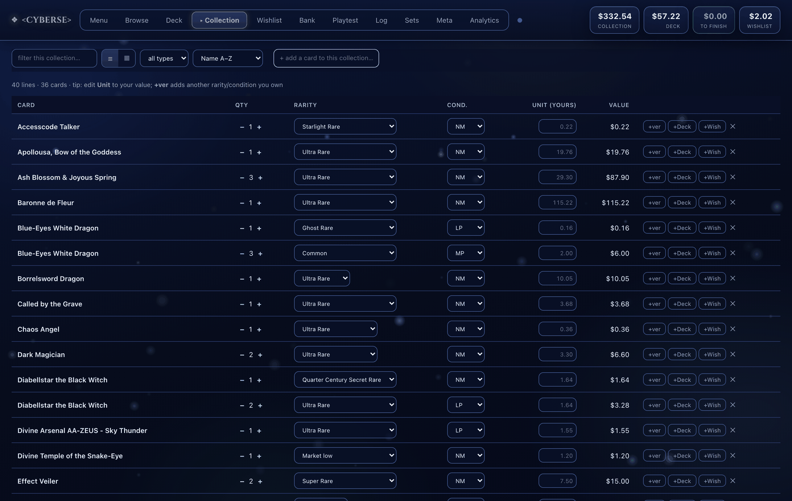
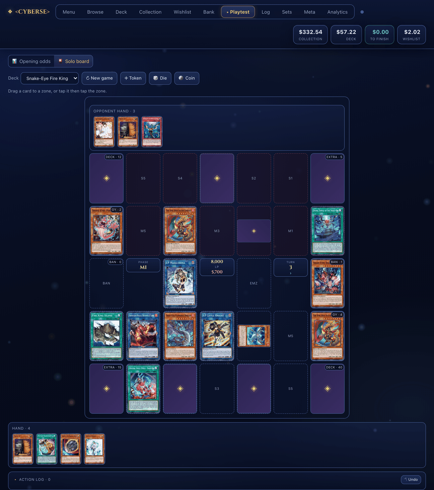
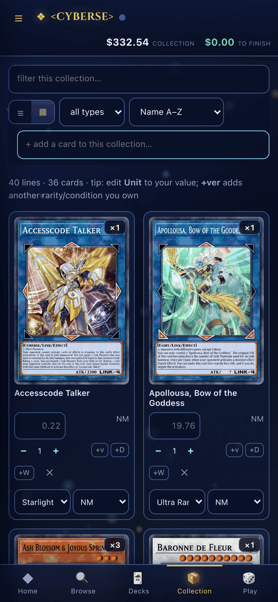
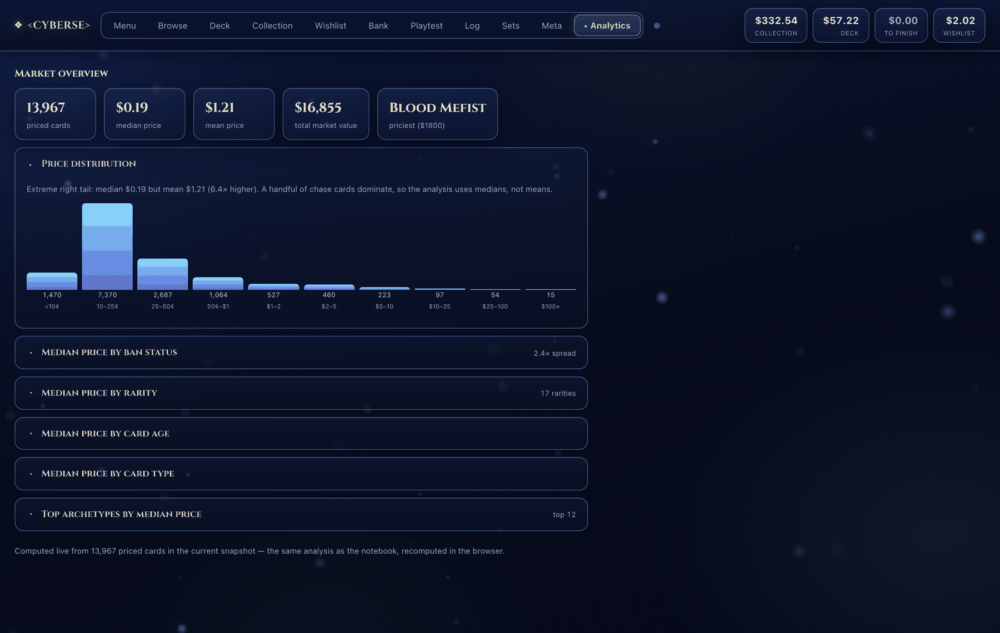

# &lt;CYBERSE&gt;

**A personal Yu-Gi-Oh! collection, pricing and playtesting app — built from a price
analysis of ~14,000 cards, and served as an installable, offline-capable web app.**

🔗 **Live app: <https://cinnamook.github.io/yugioh-price-analysis/>**



<table>
<tr>
<td width="58%"></td>
<td width="42%"></td>
</tr>
<tr>
<td align="center"><em>The solo playtest board — discrete zones, piles, life points</em></td>
<td align="center"><em>The same page on a phone, installed as a PWA</em></td>
</tr>
</table>

---

## What it is

This started as one cross-sectional question — *what actually explains a Yu-Gi-Oh!
card's price?* — answered from a single snapshot of the YGOPRODeck database. Answering
it well needed a real data pipeline, and having the pipeline made it obvious that the
findings were more useful as a tool than as a notebook. So it grew: a daily collector
that turns the snapshot into a real price history, and an app built on top of that
history which holds my collection, decks, budget, playtesting, match records and sets.
The notebook still runs, the collector still runs every day, and the app is the thing I
actually use. All three live in this repo.

## Highlights

**A price study of ~14k cards, where the honest answer was "scarcity, not playability."**
An OLS model on log-price (n = 13,934, HC3 robust errors) finds each step up the rarity
ladder is worth about **+32%**, a reprinted card about **−36%**, and a modest **~3%/year**
vintage premium. Forbidden cards do sell for roughly **2.1×** an otherwise-comparable
legal card — but that is correlational and most likely reverse-caused: cards get banned
*because* they are powerful and iconic, which is what drives collector demand anyway.
The model explains **R² ≈ 0.21 in-sample and ~0.18 held out**, so four-fifths of price
variation is competitive viability, condition and hype that structural attributes can't
see. Saying so is the finding, not a footnote.

**Reversing the unit of analysis after the data pushed back.** Printings were the obvious
unit — rarity is a printing-level attribute, and rarity was the headline variable. But
profiling found `set_price` was $0.00 for **72% of printings**, and that missingness
tracked trading volume, which tracks ban status — so the missing data would have biased
the exact sub-question the study was built around. The unit became the **card**
(card-level TCGplayer price, 96.5% coverage) with rarity re-entered as a card attribute.
Every scope call is written up against real numbers in
[analysis/DECISIONS.md](analysis/DECISIONS.md).

**Opening-hand odds, computed twice on purpose.** The playtest view tags deck cards by
role and gives exact **hypergeometric** probabilities of opening at least one — then
checks the closed form against a **20,000-hand Monte Carlo** in the browser and reports
both numbers side by side. When the formula and brute force agree, you know the model is
right; the simulation also handles the cases the closed form can't, like draw/dig cards
that resolve into more cards.

**A pipeline that has to run daily, because price history can't be back-filled.** A
launchd job pulls YGOPRODeck every day at 1pm into SQLite, appending one dated price row
per card across five marketplaces, then rebuilds and can publish the app. It's ~130k
price rows and growing, stdlib Python only, no venv.

**The app as a live data product, not a report.** The same analysis is recomputed in the
browser over the current snapshot, so the numbers age with the data instead of being
frozen in a notebook cell. It installs as a **PWA** and works offline; cross-device sync
is optional and runs on **Postgres (Supabase)** with row-level security, an emailed
one-time code for auth, a DB-owned `updated_at` as the conflict key, and a dirty-flag
guard that asks rather than silently overwriting.



## Tech stack

Python (stdlib pipeline; pandas / statsmodels / scikit-learn / seaborn for the analysis)
· SQLite · vanilla JS + localStorage, no framework and no build step · Supabase/Postgres
with RLS for sync · GitHub Pages + service worker for the PWA · launchd for automation.

## Repo layout

| | |
|---|---|
| [`analysis/`](analysis/) | The original question — `notebook.ipynb`, `DECISIONS.md` (the judgment calls, each argued against real numbers), `profile_data.py`, `figures/` |
| [`pipeline/`](pipeline/) | `collect_snapshot.py` (the daily YGOPRODeck → SQLite pull), ban-list / rarity override CSVs, `sync_schema.sql`, the launchd plist |
| [`app/`](app/) | `build_app.py` — the generator that emits the whole app. All the app's JavaScript lives inside it as a Python raw string |
| [`docs/`](docs/) | **Generated** GitHub Pages bundle (the hosted PWA). Build output, not documentation — never hand-edited |
| [`notes/`](notes/) | `ROADMAP.md` (the plan), `JOURNEY.md` (how it got here), `SYNC_DESIGN.md` (the sync + sharing design, and the traps hit building it) |

`docs/` is the one confusing name, and it's forced — GitHub Pages serves only from the
repo root or a directory literally named `docs/`. Project documentation is in `notes/`.

## Run it

```bash
# the analysis
pip install -r requirements.txt
jupyter notebook analysis/notebook.ipynb        # runs top to bottom off a cached snapshot

# the pipeline (stdlib only)
python3 pipeline/collect_snapshot.py            # append today's prices to data/ygo.db

# the app
python3 app/build_app.py && open app.html       # rebuild + open the desktop version
bash scripts/publish.command                    # rebuild, commit docs/, push to Pages
```

`data/ygo.db` is gitignored and irreplaceable once history accrues — back it up. User
data (collection, decks, logs) lives in the browser's localStorage, so a rebuild never
touches it.

## Known limitations

- **A snapshot, not a time series.** The analysis can't say anything about price
  *movement* or ban-day crashes. The daily collector exists to make that answerable
  later; as of now it holds nine days.
- **Correlation only, and asks rather than sales.** Marketplace listings are asking
  prices, and cards still in print are not a random sample of cards ever printed.
- **Coverage gaps in the source.** The free YGOPRODeck API prices only ~30% of
  printings, and there is no free API for competitive meta — so the app's meta list is a
  manual watchlist by design, not a scrape.

## What's next

[`notes/ROADMAP.md`](notes/ROADMAP.md) is the single in-repo source of the plan — north
star, status, backlog, far horizon. [`notes/JOURNEY.md`](notes/JOURNEY.md) is how the
project got from a notebook to here.

## What grew out of this

The notebook answered its question in one pass. Each piece below exists because a single
snapshot couldn't answer the question that came after it.

**The daily snapshot collector** — [`pipeline/collect_snapshot.py`](pipeline/collect_snapshot.py)
pulls YGOPRODeck once a day into SQLite, appending one dated price row per card across five
marketplaces. It exists because the analysis's central limitation is that a cross-section
can't see movement, and price history can't be back-filled — the API only serves today, so
a day the job doesn't run is a permanent hole. A launchd job runs it at 1pm and
[`pipeline/check_freshness.py`](pipeline/check_freshness.py) exits non-zero when the data is
stale, so a bad day raises a notification instead of failing quietly into a log.

**The deck planner** — [`app/deck_planner.py`](app/deck_planner.py) prices a `.ydk` decklist
at current prices and computes the cost to finish it after subtracting what you already own.
It's rarity-aware because the analysis made rarity the dominant term: if each step up the
ladder is worth roughly +32%, the useful question isn't what a card costs but what a deck
costs at the rarity you'd actually buy. Cards can be priced at the cheapest printing, at one
chosen rarity, or per-card from an overrides CSV.

**The Supabase sync layer** — localStorage is scoped per-origin and per-device, so the
desktop build, the hosted site and the phone were three separate silos with a manual JSON
export as the only bridge between them. Sync moves the one state object between devices: a
single `app_state` row on Postgres with row-level security, an emailed one-time code for
auth, and a DB-owned `updated_at` as the conflict key. Steady state is last-write-wins, but
a pull that would discard unsynced local edits writes a backup and asks rather than
overwriting — the design and the traps hit along the way are in
[`notes/SYNC_DESIGN.md`](notes/SYNC_DESIGN.md).

**The app build scripts** — [`app/build_app.py`](app/build_app.py) reads the SQLite database
and writes the entire app as one self-contained page; all of the app's JavaScript lives
inside that generator as a Python string, so the generated page is never edited by hand and
can't drift from its source. [`scripts/refresh.command`](scripts/refresh.command) chains the
daily pull, the freshness check and a publish, and
[`scripts/publish.command`](scripts/publish.command) pushes the `docs/` bundle to GitHub
Pages, staging the generator alongside its output for the same reason. One Python file in,
one HTML file out — no framework and no build step.
